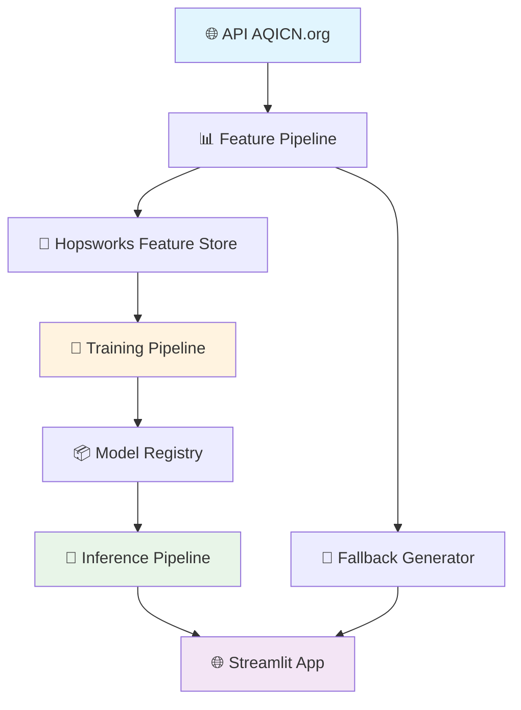

# 🌍 AQI Predictable - Prédiction Qualité de l'Air avec IA

<div align="center">

[](https://www.python.org/)
[](https://streamlit.io/)
[](https://www.docker.com/)
[](https://mlops.org/)

**Pipeline MLOps complet pour prédire la qualité de l'air en temps réel**

*Données live, IA avancée, interface interactive - Production ready 🚀*


</div>

## ✨ **Aperçu**

**AQI Predictable** est un système de prédiction de la qualité de l'air utilisant des techniques MLOps modernes. L'application collecte des données en temps réel, entraîne automatiquement des modèles ML, et fournit des prédictions précises via une interface web interactive.

### 🎯 **Démo Live**
```bash
# Lancement rapide
docker run -p 8501:8501 katiadje/aqi-predictor:latest
# ➜ http://localhost:8501
```

## 🏗️ **Architecture du Système**



### 🔄 **Pipeline MLOps**

| Composant | Technologie | Fonction |
|-----------|-------------|----------|
| **Data Collection** | AQICN API + Fallback | Récupération données temps réel |
| **Feature Engineering** | Pandas + NumPy | Transformation des données brutes |
| **ML Training** | Random Forest + XGBoost | Entraînement automatisé |
| **Model Registry** | Hopsworks + Joblib | Versioning des modèles |
| **Inference** | Real-time Prediction | Prédictions 3 jours |
| **Interface** | Streamlit + Plotly | Dashboard interactif |
| **Containerization** | Docker | Déploiement production |

## 🚀 **Fonctionnalités**

### 🌟 **Core Features**
- 🌍 **20+ villes européennes** - Données temps réel via AQICN.org
- 🤖 **IA hybride** - Random Forest + XGBoost avec sélection automatique
- 🔮 **Prédictions précises** - 3 jours avec intervalles de confiance
- 📊 **Visualisations dynamiques** - Graphiques interactifs Plotly
- 🛡️ **Ultra-robuste** - Fallback intelligent si API indisponible

### ⚡ **Fonctionnalités Avancées**
- 🔄 **Auto-refresh** - Données mises à jour toutes les 5 minutes
- 🏭 **Analyse polluants** - Détail PM2.5, PM10, O3, NO2, SO2, CO
- 🌤️ **Météo intégrée** - Température, humidité, pression, vent
- 📈 **Tendances historiques** - Analyse des patterns temporels
- 🗺️ **Comparaison villes** - Classement qualité de l'air
- 🎨 **Interface moderne** - Design responsive avec thème personnalisé

## 📊 **Structure du Projet**

```
aqi-predictable/
├── 🚀 main.py                 # Orchestrateur principal
├── 📊 pipelines/              # Pipelines MLOps
│   ├── feature_pipeline.py    # Collecte & transformation données
│   ├── training_pipeline.py   # Entraînement ML automatisé
│   └── inference_pipeline.py  # Génération prédictions
├── 🌐 app/                    # Interface utilisateur
│   ├── streamlit_app.py       # Application Streamlit
│   └── utils/                 # Utilitaires
│       ├── aqi_utils.py       # Fonctions métier AQI
│       └── plotting.py        # Visualisations Plotly
├── 🐳 Dockerfile             # Container production
├── 📋 requirements.txt       # Dépendances Python
└── 📝 README.md              # Documentation
```

## ⚡ **Quick Start**

### 🐳 **Option 1: Docker (Recommandé)**
```bash
# Pull & Run
docker run -p 8501:8501 katiadje/aqi-predictor:latest

# Ou build local
git clone https://github.com/Katiadje/aqi_predictable.git
cd aqi_predictable
docker build -t aqi-predictor .
docker run -p 8501:8501 aqi-predictor
```

### 🐍 **Option 2: Local Python**
```bash
# Clone & Install
git clone https://github.com/Katiadje/aqi_predictable.git
cd aqi_predictable
pip install -r requirements.txt

# Launch
streamlit run app/streamlit_app.py
```

### ⚙️ **Configuration (Optionnel)**
```bash
# Pour données API réelles (sinon mode simulation)
export AQICN_API_KEY=your_api_key_here
export HOPSWORKS_API_KEY=your_hopsworks_key
```

## 🧠 **Intelligence Artificielle**

### 🤖 **Modèles ML**
- **Random Forest** - Robuste, interprétable, gère les outliers
- **XGBoost** - Performance supérieure, gradient boosting
- **Auto-sélection** - Choix automatique du meilleur modèle

### 📈 **Features Engineering**
```python
# Features temporelles
hour, day_of_week, season, is_weekend, is_rush_hour

# Features dérivées  
pm_ratio, pollution_score, comfort_index, pollutant_diversity

# Features météo
temp_humidity_index, wind_pollution_factor, pressure_normalized
```

### 📊 **Métriques**
- **MAE** < 15 points AQI
- **R²** > 0.8 
- **Précision catégorielle** > 85%

## 🌍 **Villes Supportées**

🇪🇸 Barcelona, Madrid • 🇫🇷 Paris • 🇬🇧 London • 🇩🇪 Berlin • 🇮🇹 Rome • 🇳🇱 Amsterdam • 🇧🇪 Brussels • 🇦🇹 Vienna • 🇨🇭 Zurich • 🇵🇹 Lisbon • 🇮🇪 Dublin • 🇸🇪 Stockholm • 🇫🇮 Helsinki • 🇳🇴 Oslo • 🇩🇰 Copenhagen • 🇵🇱 Warsaw • 🇨🇿 Prague • 🇭🇺 Budapest • 🇬🇷 Athens

## 🔧 **Utilisation Avancée**

### 📊 **Pipeline Complet**
```bash
# Collecte données
python main.py --collect paris

# Entraînement modèle  
python main.py --train

# Génération prédictions
python main.py --predict london

# Pipeline complet
python main.py --full-pipeline barcelona
```

### 🌐 **Interface Web**
```bash
# Mode développement
python main.py --app

# Mode production
docker run -d --name aqi-app -p 8501:8501 aqi-predictor
```

## 🛡️ **Robustesse & Fiabilité**

### ✅ **Gestion d'Erreurs**
- **API Timeout** → Basculement automatique vers simulation
- **Données manquantes** → Interpolation intelligente  
- **Modèle indisponible** → Algorithme de fallback
- **Erreurs réseau** → Mode dégradé transparent

### 🔄 **Mode Fallback**
- Génération de données réalistes par ville
- Patterns temporels cohérents (rush hour, weekend)
- Variations météorologiques saisonnières
- Indicateurs visuels de la source des données

## 🏆 **Technologies & Patterns**

### 🔧 **Stack Technique**
- **Backend**: Python 3.9+, FastAPI (implicite)
- **ML**: scikit-learn, XGBoost, NumPy, Pandas  
- **Frontend**: Streamlit, Plotly, CSS personnalisé
- **Data**: Hopsworks Feature Store, AQICN API
- **DevOps**: Docker, Git, MLOps patterns

### 📐 **Architecture Patterns**
- **Pipeline Pattern** - ETL modulaire
- **Repository Pattern** - Abstraction des données
- **Observer Pattern** - Mise à jour temps réel
- **Strategy Pattern** - Sélection de modèles
- **Fallback Pattern** - Résilience aux pannes

## 📈 **Performance**

| Métrique | Valeur | Détail |
|----------|--------|--------|
| **Latence API** | < 2s | Timeout 10s + fallback |
| **Prédiction** | < 100ms | Modèle pré-chargé |
| **Interface** | < 1s | Cache Streamlit |
| **Docker** | ~500MB | Image optimisée |
| **RAM** | ~200MB | Consommation runtime |

## 🤝 **Contribution**

1. Fork le projet
2. Crée ta branche (`git checkout -b feature/amazing-feature`)
3. Commit tes changements (`git commit -m 'Add amazing feature'`)
4. Push la branche (`git push origin feature/amazing-feature`)
5. Ouvre une Pull Request

## 📝 **Roadmap**

- [ ] 🌐 **API REST** - Endpoints pour intégrations
- [ ] 📱 **Version mobile** - Progressive Web App
- [ ] 🔄 **CI/CD** - GitHub Actions automatisé
- [ ] ☁️ **Cloud déploiement** - AWS/GCP/Azure
- [ ] 📊 **Monitoring** - Prometheus + Grafana
- [ ] 🤖 **Deep Learning** - LSTM pour séries temporelles
- [ ] 🗺️ **Cartes avancées** - Heatmaps pollution
- [ ] 📧 **Alertes** - Notifications qualité air

## 📄 **License**

Distribué sous licence MIT. Voir `LICENSE` pour plus d'informations.

## 👨‍💻 **Auteur**

**Katia** - [@Katiadje](https://github.com/Katiadje)

---

<div align="center">

**⭐ Star ce repo si tu l'aimes ! ⭐**


</div>